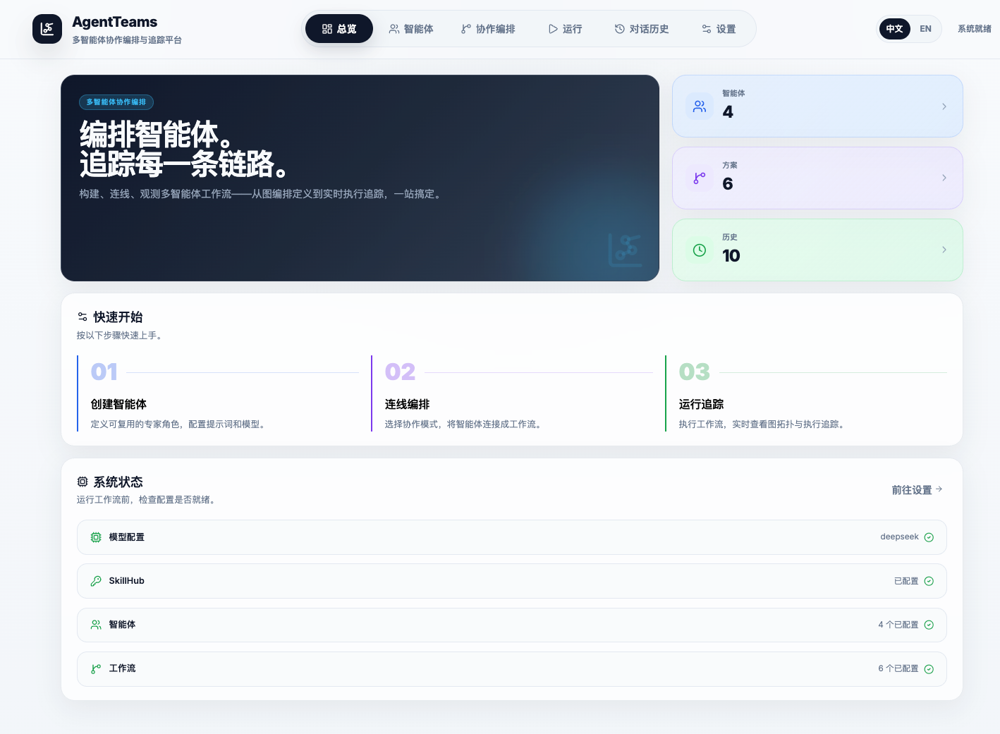
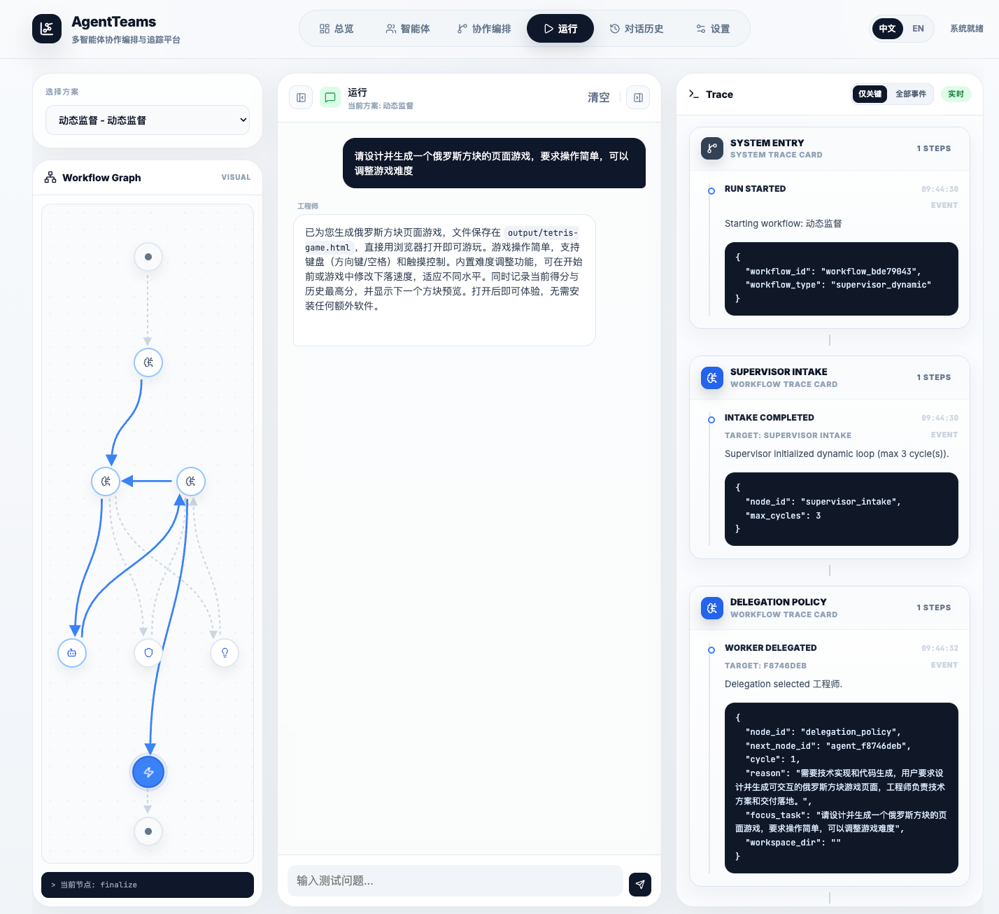
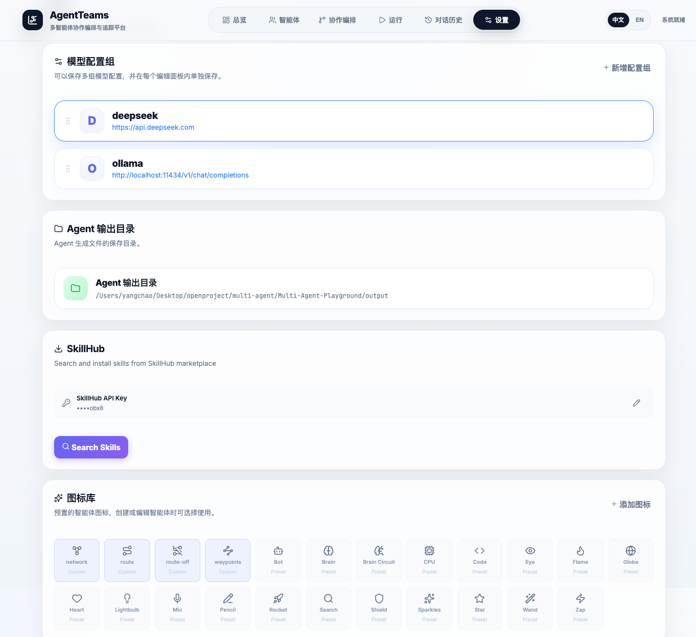
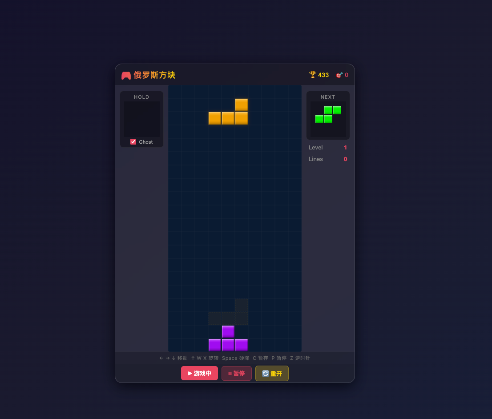

# Agent-Teams

<div align="center">

**多智能体协作编排与追踪平台**

构建、连线、观测多智能体工作流——从图编排定义到实时执行追踪，一站搞定。

[](LICENSE)
[](https://www.python.org/)
[](https://vuejs.org/)

</div>

---

## 功能特性

- **智能体管理** - 创建可复用的专家角色，配置提示词、模型和技能
- **协作编排** - 5 种工作流模式，支持复杂的智能体协作场景
- **实时追踪** - 可视化执行图，实时查看路由决策和事件流
- **技能系统** - 从 SkillHub 发现和安装技能，扩展智能体能力
- **桌面应用** - 支持 Electron 打包为独立桌面应用

## 界面预览







## 项目结构

```
Agent-Teams/
├── backend/              # Python FastAPI 后端
│   ├── app/             # 应用代码
│   │   ├── workflows/   # 基于 LangGraph 的 5 种工作流实现
│   │   └── routes.py    # API 路由
│   ├── skills/          # 已安装的技能
│   ├── data/            # SQLite 数据库
│   └── requirements.txt
├── frontend/            # Vue 3 前端
│   └── src/
│       ├── pages/       # 页面组件
│       ├── components/  # 通用组件
│       └── i18n.js      # 国际化
├── desktop/             # Electron 桌面端打包
├── docs/                # 文档和图片
└── .env                 # 环境变量配置
```

## 快速开始

### 1. 克隆项目

```bash
git clone https://github.com/qianbaidu1266/Multi-Agent-Playground.git
cd Multi-Agent-Playground
```

### 2. 配置环境变量

```bash
cp .env.example .env
```

编辑 `.env` 文件，配置必要的 API 密钥：

```bash
# OpenAI 配置（必填）
OPENAI_API_KEY=sk-...
OPENAI_BASE_URL=https://api.openai.com/v1
OPENAI_MODEL=gpt-4o-mini

# SkillHub 配置（可选，用于技能发现和安装）
SKILLHUB_API_KEY=your-skillhub-api-key
SKILLHUB_BASE_URL=https://www.skillhub.club/api/v1
```

### 3. 启动后端

```bash
cd backend
python3 -m venv .venv
source .venv/bin/activate  # Windows: .venv\Scripts\activate
pip install -r requirements.txt
uvicorn app.main:app --host 127.0.0.1 --port 8011
```

### 4. 启动前端

```bash
cd frontend
npm install
npm run dev
```

访问 http://localhost:5173 即可使用。

---

## 工作流模式

Agent-Teams 支持 5 种智能体协作模式，满足不同场景需求：

### 1. 单智能体对话 (Single Agent Chat)

```
用户 → Agent → 响应
```

最简单的模式，直接与单个智能体对话。适合单一任务场景，如代码生成、文档撰写等。

### 2. 路由专家 (Router Specialists)

```
用户 → Router → 选择最佳专家 → [Finalizer] → 响应
```

路由器根据用户意图选择最匹配的专家智能体，可选经过 Finalizer 统一收口。适合多领域问答、多功能助手等场景。

### 3. 规划执行 (Planner Executor)

```
用户 → Planner → 拆解任务 → Workers 执行 → 合成响应
```

规划器将复杂任务拆解为子任务，分配给多个 Worker 执行，最后合成完整答案。适合复杂分析、多步骤任务等场景。

### 4. 动态监督 (Supervisor Dynamic)

```
用户 → Supervisor → 动态分配 → Workers 循环执行 → 收敛响应
```

监督者在运行时动态决定任务分配，Worker 可以循环执行直到任务完成。适合不确定性强、需要迭代的任务。

### 5. 同伴交接 (Peer Handoff)

```
用户 → Router → 专家A ⇄ 专家B ⇄ 专家C → 响应
```

专家之间在共享协作区内相互交接任务，直到问题解决。适合需要多轮协作、知识互补的场景。

---

## 技能系统 (Skills)

### 什么是技能？

技能是智能体的能力扩展，可以赋予智能体特定的专业能力，如：
- **前端设计** - 生成高质量的前端界面
- **系统调试** - 系统化的问题排查流程
- **技能创建** - 创建新的技能
- **文档审查** - 审查文档风格和结构

### 从 SkillHub 安装技能

1. 在设置页面配置 `SKILLHUB_API_KEY`
2. 点击 "Search Skills" 搜索技能
3. 选择需要的技能点击安装

### 手动创建技能

在 `backend/skills/` 目录下创建技能文件夹：

```
backend/skills/my-skill/
├── skill.json      # 技能元数据
└── SKILL.md        # 技能说明文档
```

`skill.json` 示例：

```json
{
  "id": "skill_xxxxxxxx",
  "name": "my-skill",
  "description": "技能描述",
  "instruction": "使用该技能的指导说明",
  "source_provider": "local"
}
```

### 绑定技能到智能体

1. 进入智能体管理页面
2. 选择或创建智能体
3. 在技能列表中选择要绑定的技能
4. 保存智能体配置

---

## 配置说明

### 环境变量

| 变量 | 说明 | 必填 |
|------|------|------|
| `OPENAI_API_KEY` | OpenAI API 密钥 | ✅ |
| `OPENAI_BASE_URL` | API 基础 URL | ❌ |
| `OPENAI_MODEL` | 默认模型 | ❌ |
| `SKILLHUB_API_KEY` | SkillHub API 密钥 | ❌ |
| `SKILLHUB_BASE_URL` | SkillHub 基础 URL | ❌ |
| `AGENT_OUTPUT_DIR` | 智能体输出目录 | ❌ |

### 模型配置

支持配置多个模型配置组，可以：
- 配置不同的 API 提供商（OpenAI、Azure、本地模型等）
- 为不同智能体指定不同模型
- 动态切换活跃配置

---

## 桌面端打包

将应用打包为独立的 Electron 桌面应用。

### 前置条件

```bash
cd backend
source .venv/bin/activate
pip install -r requirements-desktop.txt
```

### macOS

```bash
cd desktop
npm install
npm run dist:mac        # 未签名构建
npm run dist:mac:signed # 签名发布构建
```

### Windows

```bash
cd desktop
npm install
npm run dist:win
```

构建产物输出到 `desktop/release/`。

---

## 技术栈

- **后端**: Python 3.12+ / FastAPI / LangGraph / SQLite
- **前端**: Vue 3 / Vite / Lucide Icons
- **桌面**: Electron / PyInstaller

---

## 许可证

[MIT License](LICENSE)

---

## 贡献

欢迎提交 Issue 和 Pull Request！
